# Documentación de código — `hello_m5_cardputer_adv`

**Repositorio:** `arfipod/hello_m5_cardputer_adv`  
**Rama revisada:** `main`  
**Commit revisado:** `08036439f1c7adbb930f7d17ed8b3d493dfa5bc6`  
**Fecha de revisión:** 2026-06-10  
**Idioma:** Español  
**Objetivo del documento:** servir como documentación imprimible y como mapa técnico del template ESP-IDF/PlatformIO para M5 Cardputer-Adv.

---

## 1. Resumen ejecutivo

Este repositorio es un **template base reutilizable** para desarrollar firmware C++17 sobre **ESP-IDF + PlatformIO** para la **M5 Cardputer-Adv / Stamp-S3A / ESP32-S3**.

La arquitectura actual está planteada en capas:

1. `src/main.cpp`: punto de entrada ESP-IDF.
2. `src/app/`: shell de aplicación, estado y eventos.
3. `src/apps/smoke_tests/`: modos de prueba seleccionados por flags de compilación.
4. `src/hardware/`: HALs o wrappers de bajo nivel para periféricos de placa.
5. `src/services/`: servicios de sistema como Wi-Fi, BLE y USB.
6. `src/ui/`: integración futura de LVGL.
7. `lib/common/`: utilidades portables sin dependencia ESP-IDF.
8. `test/`: tests nativos PlatformIO/Unity.

El template **no es todavía una aplicación final**, sino una base de bring-up. Algunos periféricos están ya preparados y otros son hooks/stubs explícitos que devuelven `ESP_ERR_NOT_SUPPORTED` hasta completar la secuencia real de inicialización.

### Estado funcional resumido

| Subsistema | Estado actual | Comentario |
|---|---|---|
| Boot info | Implementado | Imprime chip, flash, heap y motivo de reset. |
| I2C | Implementado | Bus master con mutex, lectura/escritura y escaneo. |
| Teclado TCA8418 | Parcial | Init y lectura FIFO preparados; layout placeholder pendiente de validación. |
| Pantalla ST7789 | Preparado | SPI directo, backlight, píxeles, rectángulos, líneas y texto 5x7. |
| Audio / Speaker | Parcial | I2S preparado; ES8311 codec aún sin secuencia de registros. |
| microSD | Preparado | Montaje SDSPI, listado y escritura opcional. |
| IMU BMI270 | Stub parcial | Probe del chip ID preparado; init/lectura real no implementadas. |
| Batería ADC | Preparado | Lectura raw y estimación mV con calibración ADC si está disponible. |
| IR TX | Preparado | Transmisión RMT raw con carrier de 38 kHz. |
| Wi-Fi | Preparado opcional | Servicio STA con init, scan, connect y wait. |
| BLE | Stub | API preparada, sin bring-up de host/controller/GATT. |
| USB | Stub | API preparada, sin TinyUSB/descriptores/endpoints. |
| LVGL | Stub | Hook preparado, sin dependencia/configuración real. |
| LED dedicado | No detectado | No existe clase LED ni pin de LED de usuario. El actuador similar presente es `LCD_BL`, backlight de pantalla. |

---

## 2. Estructura del repositorio

```text
hello_m5_cardputer_adv/
├── platformio.ini
├── partitions.csv
├── README.md
├── docs/
│   ├── architecture.md
│   ├── hardware.md
│   ├── pinout.md
│   └── smoke-tests.md
├── lib/
│   └── common/
│       └── include/
│           └── common/
│               ├── result.hpp
│               └── ring_buffer.hpp
├── src/
│   ├── main.cpp
│   ├── app/
│   │   ├── App.hpp
│   │   ├── App.cpp
│   │   ├── AppState.hpp
│   │   └── AppEvents.hpp
│   ├── apps/
│   │   └── smoke_tests/
│   │       ├── SmokeTests.hpp
│   │       └── SmokeTests.cpp
│   ├── hardware/
│   │   ├── BoardPins.hpp
│   │   ├── I2CBus.hpp/.cpp
│   │   ├── Tca8418Keyboard.hpp/.cpp
│   │   ├── St7789Display.hpp/.cpp
│   │   ├── Es8311Codec.hpp/.cpp
│   │   ├── I2SAudio.hpp/.cpp
│   │   ├── Bmi270Imu.hpp/.cpp
│   │   ├── SdCard.hpp/.cpp
│   │   ├── BatteryMonitor.hpp/.cpp
│   │   └── IrTransmitter.hpp/.cpp
│   ├── services/
│   │   ├── WifiService.hpp/.cpp
│   │   ├── BleService.hpp/.cpp
│   │   └── UsbService.hpp/.cpp
│   └── ui/
│       └── LvglPort.hpp/.cpp
└── test/
    └── test_common/
        └── test_main.cpp
```

---

## 3. Configuración de build

El proyecto usa PlatformIO con ESP-IDF. La configuración principal está en `platformio.ini`.

### 3.1. Entornos principales

| Entorno | Board | Propósito |
|---|---|---|
| `cardputer_adv` | `m5stack-stamps3` | Firmware base por defecto. |
| `cardputer_adv_devkit_fallback` | `esp32-s3-devkitc-1` | Build alternativo para fallback/devkit. |
| `native` | host | Tests unitarios sin ESP-IDF. |

### 3.2. Entornos smoke-test

| Entorno | Flag de modo | Propósito |
|---|---|---|
| `cardputer_adv_i2c_scan` | `APP_MODE_I2C_SCAN=1` | Escaneo I2C. |
| `cardputer_adv_keyboard_test` | `APP_MODE_KEYBOARD_TEST=1` | Prueba teclado TCA8418. |
| `cardputer_adv_display_test` | `APP_MODE_DISPLAY_TEST=1` | Prueba pantalla ST7789. |
| `cardputer_adv_audio_test` | `APP_MODE_AUDIO_TEST=1` | Prueba audio/I2S/codec. |
| `cardputer_adv_sd_test` | `APP_MODE_SD_TEST=1` | Prueba microSD. |
| `cardputer_adv_imu_test` | `APP_MODE_IMU_TEST=1` | Prueba IMU BMI270. |
| `cardputer_adv_battery_test` | `APP_MODE_BATTERY_TEST=1` | Prueba batería ADC. |
| `cardputer_adv_ir_test` | `APP_MODE_IR_TEST=1` | Prueba IR TX. |
| `cardputer_adv_lvgl_demo` | `APP_MODE_LVGL_DEMO=1` | Hook demo LVGL. |
| `cardputer_adv_wifi_test` | `APP_MODE_WIFI_TEST=1` | Scan/conexión Wi-Fi. |
| `cardputer_adv_full_smoke_test` | `APP_MODE_FULL_SMOKE_TEST=1` | Prueba integrada de placa. |

### 3.3. Flags de subsistema

Flags base activos por defecto:

```ini
-DAPP_TARGET_CARDPUTER_ADV=1
-DAPP_ENABLE_DISPLAY=1
-DAPP_ENABLE_KEYBOARD=1
-DAPP_ENABLE_AUDIO=1
-DAPP_ENABLE_IMU=1
-DAPP_ENABLE_SD=1
-DAPP_ENABLE_BATTERY=1
-DAPP_ENABLE_IR=1
-DAPP_SMOKE_SD_WRITE=0
```

Flags opcionales desactivados por defecto:

```ini
-DAPP_ENABLE_WIFI=0
-DAPP_ENABLE_BLE=0
-DAPP_ENABLE_LVGL=0
-DAPP_ENABLE_USB=0
```

Esto significa que Wi-Fi, BLE, LVGL y USB existen como API/hook, pero no se enlazan como rutas activas salvo en entornos concretos.

---

## 4. Flujo general de arranque

### 4.1. Descripción paso a paso

1. ESP-IDF llama a `app_main()` en `src/main.cpp`.
2. `app_main()` configura el nivel de log global con `esp_log_level_set`.
3. Lee información del chip con `esp_chip_info()`.
4. Lee tamaño de flash con `esp_flash_get_size()`.
5. Imprime logs de arranque.
6. Crea un objeto local `cardputer::app::App app`.
7. Ejecuta `app.run()`.
8. `App::run()` imprime flags de subsistemas.
9. `App::run()` ejecuta `reportPendingBringupHooks()`.
10. `reportPendingBringupHooks()` crea objetos de codec, IMU, LVGL, Wi-Fi, BLE y USB y llama a sus `init()`.
11. Se registra cada resultado con `logHookResult()`.
12. `App::run()` llama a `smoke_tests::runSelectedMode()`.
13. `runSelectedMode()` usa macros de compilación para decidir qué modo ejecutar.

### 4.2. Diagrama de secuencia de arranque

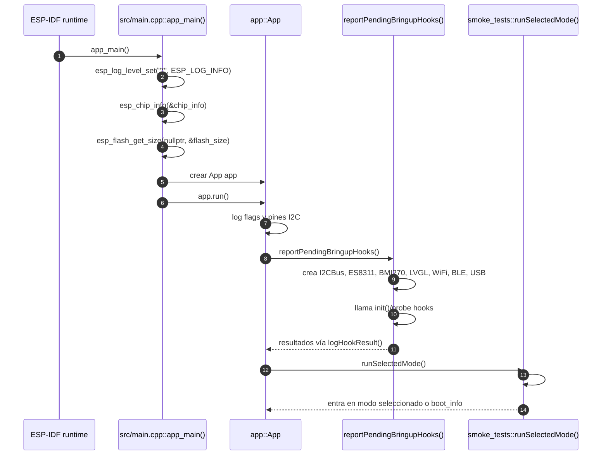
```mermaid
sequenceDiagram
    autonumber
    participant IDF as ESP-IDF runtime
    participant Main as src/main.cpp::app_main()
    participant App as app::App
    participant Hooks as reportPendingBringupHooks()
    participant Smoke as smoke_tests::runSelectedMode()

    IDF->>Main: app_main()
    Main->>Main: esp_log_level_set("*", ESP_LOG_INFO)
    Main->>Main: esp_chip_info(&chip_info)
    Main->>Main: esp_flash_get_size(nullptr, &flash_size)
    Main->>App: crear App app
    Main->>App: app.run()
    App->>App: log flags y pines I2C
    App->>Hooks: reportPendingBringupHooks()
    Hooks->>Hooks: crea I2CBus, ES8311, BMI270, LVGL, WiFi, BLE, USB
    Hooks->>Hooks: llama init()/probe hooks
    Hooks-->>App: resultados vía logHookResult()
    App->>Smoke: runSelectedMode()
    Smoke->>Smoke: #if APP_MODE_...
    Smoke-->>App: entra en modo seleccionado o boot_info
```

---

## 5. Pin map de placa

`src/hardware/BoardPins.hpp` es la **fuente única de verdad** para pines físicos.

| Función | GPIO |
|---|---:|
| I2C SDA | G8 |
| I2C SCL | G9 |
| Keyboard INT | G11 |
| Battery ADC | G10 |
| SD CS | G12 |
| SD MOSI | G14 |
| SD CLK | G40 |
| SD MISO | G39 |
| LCD BL | G38 |
| LCD RST | G33 |
| LCD DC | G34 |
| LCD MOSI | G35 |
| LCD SCK | G36 |
| LCD CS | G37 |
| I2S BCLK | G41 |
| I2S DOUT to codec | G42 |
| I2S LRCLK | G43 |
| I2S DIN from codec | G46 |
| IR TX | G44 |
| Grove G1/G2 | G1/G2 |
| EXT reset | G3 |
| EXT int | G4 |
| EXT CS | G5 |
| EXT busy | G6 |
| EXT UART RX/TX | G13/G15 |
| BOOT | G0 |

### Nota sobre LED

No he encontrado en el código una clase `Led`, `RgbLed`, `StatusLed` ni un pin dedicado a LED de usuario. El único actuador tipo “luz” implementado es el **backlight de la pantalla**, controlado mediante `pins::LCD_BL` / GPIO38 por `St7789Display::setBacklight(bool)`.

---

## 6. Diagrama UML general de clases

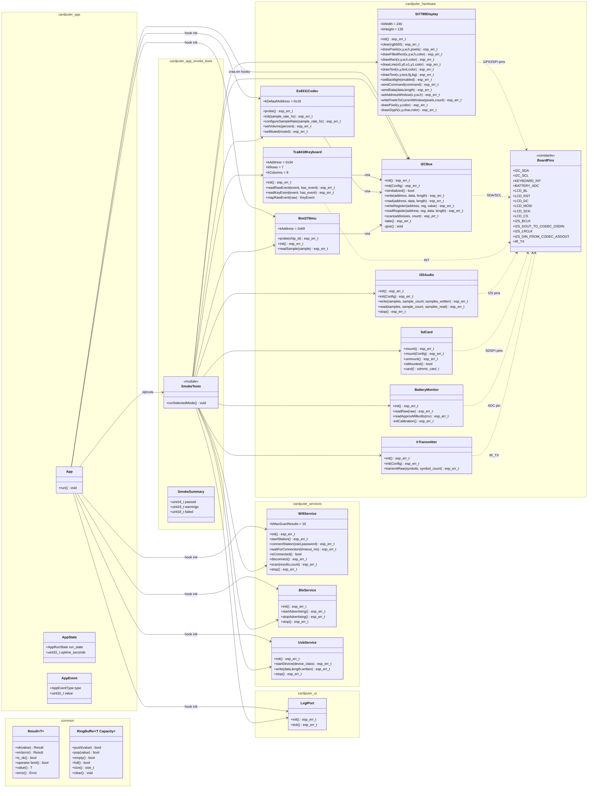
```mermaid
classDiagram
    direction LR

    namespace cardputer_app {
        class App {
            +run() void
        }
        class AppState {
            +AppRunState run_state
            +uint32_t uptime_seconds
        }
        class AppEvent {
            +AppEventType type
            +uint32_t value
        }
    }

    namespace cardputer_app_smoke_tests {
        class SmokeTests {
            <<module>>
            +runSelectedMode() void
        }
        class SmokeSummary {
            +uint16_t passed
            +uint16_t warnings
            +uint16_t failed
        }
    }

    namespace cardputer_hardware {
        class BoardPins {
            <<constants>>
            +I2C_SDA
            +I2C_SCL
            +KEYBOARD_INT
            +BATTERY_ADC
            +LCD_BL
            +LCD_RST
            +LCD_DC
            +LCD_MOSI
            +LCD_SCK
            +LCD_CS
            +I2S_BCLK
            +I2S_DOUT_TO_CODEC_DSDIN
            +I2S_LRCLK
            +I2S_DIN_FROM_CODEC_ASDOUT
            +IR_TX
        }

        class I2CBus {
            +init() esp_err_t
            +init(Config) esp_err_t
            +isInitialized() bool
            +write(address, data, length) esp_err_t
            +read(address, data, length) esp_err_t
            +writeRegister(address, reg, value) esp_err_t
            +readRegister(address, reg, data, length) esp_err_t
            +scan(addresses, count) esp_err_t
            -take() esp_err_t
            -give() void
        }

        class Tca8418Keyboard {
            +kAddress = 0x34
            +kRows = 7
            +kColumns = 8
            +init() esp_err_t
            +readRawEvent(event, has_event) esp_err_t
            +readKeyEvent(event, has_event) esp_err_t
            +mapRawEvent(raw) KeyEvent
        }

        class St7789Display {
            +kWidth = 240
            +kHeight = 135
            +init() esp_err_t
            +clear(rgb565) esp_err_t
            +drawPixels(x,y,w,h,pixels) esp_err_t
            +drawFilledRect(x,y,w,h,color) esp_err_t
            +drawRect(x,y,w,h,color) esp_err_t
            +drawLine(x0,y0,x1,y1,color) esp_err_t
            +drawText(x,y,text,color) esp_err_t
            +drawText(x,y,text,fg,bg) esp_err_t
            +setBacklight(enabled) esp_err_t
            -sendCommand(command) esp_err_t
            -sendData(data,length) esp_err_t
            -setAddressWindow(x,y,w,h) esp_err_t
            -writePixelsToCurrentWindow(pixels,count) esp_err_t
            -drawPixel(x,y,color) esp_err_t
            -drawGlyph(x,y,char,color) esp_err_t
        }

        class Es8311Codec {
            +kDefaultAddress = 0x18
            +probe() esp_err_t
            +init(sample_rate_hz) esp_err_t
            +configureSampleRate(sample_rate_hz) esp_err_t
            +setVolume(percent) esp_err_t
            +setMuted(muted) esp_err_t
        }

        class I2SAudio {
            +init() esp_err_t
            +init(Config) esp_err_t
            +write(samples, sample_count, samples_written) esp_err_t
            +read(samples, sample_count, samples_read) esp_err_t
            +stop() esp_err_t
        }

        class Bmi270Imu {
            +kAddress = 0x69
            +probe(chip_id) esp_err_t
            +init() esp_err_t
            +readSample(sample) esp_err_t
        }

        class SdCard {
            +mount() esp_err_t
            +mount(Config) esp_err_t
            +unmount() esp_err_t
            +isMounted() bool
            +card() sdmmc_card_t*
        }

        class BatteryMonitor {
            +init() esp_err_t
            +readRaw(raw) esp_err_t
            +readApproxMillivolts(mv) esp_err_t
            -initCalibration() esp_err_t
        }

        class IrTransmitter {
            +init() esp_err_t
            +init(Config) esp_err_t
            +transmitRaw(symbols, symbol_count) esp_err_t
        }
    }

    namespace cardputer_services {
        class WifiService {
            +kMaxScanResults = 16
            +init() esp_err_t
            +startStation() esp_err_t
            +connectStation(ssid,password) esp_err_t
            +waitForConnection(timeout_ms) esp_err_t
            +isConnected() bool
            +disconnect() esp_err_t
            +scan(results,count) esp_err_t
            +stop() esp_err_t
        }
        class BleService {
            +init() esp_err_t
            +startAdvertising() esp_err_t
            +stopAdvertising() esp_err_t
            +stop() esp_err_t
        }
        class UsbService {
            +init() esp_err_t
            +startDevice(device_class) esp_err_t
            +write(data,length,written) esp_err_t
            +stop() esp_err_t
        }
    }

    namespace cardputer_ui {
        class LvglPort {
            +init() esp_err_t
            +tick() esp_err_t
        }
    }

    namespace common {
        class Result~T~ {
            +ok(value) Result
            +err(error) Result
            +is_ok() bool
            +operator bool() bool
            +value() T
            +error() Error
        }
        class RingBuffer~T Capacity~ {
            +push(value) bool
            +pop(value) bool
            +empty() bool
            +full() bool
            +size() size_t
            +clear() void
        }
    }

    App --> SmokeTests : ejecuta
    App --> I2CBus : crea en hooks
    App --> Es8311Codec : hook init
    App --> Bmi270Imu : hook init
    App --> WifiService : hook init
    App --> BleService : hook init
    App --> UsbService : hook init
    App --> LvglPort : hook init

    SmokeTests --> I2CBus
    SmokeTests --> Tca8418Keyboard
    SmokeTests --> St7789Display
    SmokeTests --> Es8311Codec
    SmokeTests --> I2SAudio
    SmokeTests --> Bmi270Imu
    SmokeTests --> SdCard
    SmokeTests --> BatteryMonitor
    SmokeTests --> IrTransmitter
    SmokeTests --> WifiService
    SmokeTests --> BleService
    SmokeTests --> UsbService
    SmokeTests --> LvglPort

    Tca8418Keyboard --> I2CBus : usa
    Es8311Codec --> I2CBus : usa
    Bmi270Imu --> I2CBus : usa

    St7789Display ..> BoardPins : GPIO/SPI pins
    I2CBus ..> BoardPins : SDA/SCL
    Tca8418Keyboard ..> BoardPins : INT
    I2SAudio ..> BoardPins : I2S pins
    SdCard ..> BoardPins : SDSPI pins
    BatteryMonitor ..> BoardPins : ADC pin
    IrTransmitter ..> BoardPins : IR_TX
```

---

## 7. Documentación por módulo

## 7.1. `src/main.cpp`

Responsabilidad:

- Ser el punto de entrada ESP-IDF.
- Configurar logs.
- Leer datos básicos de chip y flash.
- Crear y ejecutar `cardputer::app::App`.

Flujo:

```cpp
extern "C" void app_main(void) {
    esp_log_level_set("*", ESP_LOG_INFO);
    esp_chip_info(&chip_info);
    esp_flash_get_size(nullptr, &flash_size);
    cardputer::app::App app;
    app.run();
}
```

Es deliberadamente pequeño: no contiene lógica de periféricos. Delega en `App`.

---

## 7.2. `src/app/App.hpp` y `src/app/App.cpp`

Responsabilidad:

- Actuar como shell genérico de aplicación.
- Registrar flags de subsistemas.
- Ejecutar hooks de bring-up pendiente.
- Lanzar el modo smoke seleccionado.

Método principal:

```cpp
void App::run();
```

`App::run()` hace tres cosas importantes:

1. Imprime `Generic App started`.
2. Muestra pines I2C y flags `APP_ENABLE_*`.
3. Llama a:

```cpp
reportPendingBringupHooks();
smoke_tests::runSelectedMode();
```

### Hook `reportPendingBringupHooks()`

Crea instancias locales de:

- `hardware::I2CBus`
- `hardware::Es8311Codec`
- `hardware::Bmi270Imu`
- `ui::LvglPort`
- `services::WifiService`
- `services::BleService`
- `services::UsbService`

Luego llama a:

- `codec.init(44100)`
- `imu.init()`
- `lvgl.init()`
- `wifi.init()`
- `ble.init()`
- `usb.init()`

Importante: en este hook se llama a `codec.init()` y `imu.init()` usando un `I2CBus` recién creado pero **no inicializado**. Sin embargo, esos `init()` concretos ahora mismo son stubs y devuelven `ESP_ERR_NOT_SUPPORTED`, por lo que no acceden realmente al bus. Cuando se implemente init real de ES8311/BMI270, habrá que revisar este hook para inicializar antes el bus o convertirlo en un probe seguro.

---

## 7.3. `src/app/AppState.hpp`

Define un estado de aplicación mínimo:

```cpp
enum class AppRunState : uint8_t {
    Booting,
    Running,
    Error,
};

struct AppState {
    AppRunState run_state = AppRunState::Booting;
    uint32_t uptime_seconds = 0;
};
```

Actualmente no está integrado en `App::run()`. Es una base para una aplicación futura con estado explícito.

---

## 7.4. `src/app/AppEvents.hpp`

Define eventos internos mínimos:

```cpp
enum class AppEventType : uint8_t {
    None,
    Tick,
    PeripheralReady,
    PeripheralError,
};

struct AppEvent {
    AppEventType type = AppEventType::None;
    uint32_t value = 0;
};
```

Actualmente no hay cola de eventos ni dispatcher. Es scaffolding para una arquitectura futura más reactiva.

---

## 7.5. `src/apps/smoke_tests/SmokeTests.hpp/.cpp`

Responsabilidad:

- Contener los modos de prueba seleccionables por `platformio.ini`.
- Evitar mezclar tests de hardware dentro de `App`.
- Probar cada subsistema de forma aislada.

### Estructuras internas

```cpp
enum class CheckStatus : uint8_t {
    Pass,
    Warn,
    Fail,
};

struct SmokeSummary {
    uint16_t passed = 0;
    uint16_t warnings = 0;
    uint16_t failed = 0;
};
```

`recordCheck()` y `recordErr()` centralizan logging de resultados.

### Selector de modo

```cpp
void runSelectedMode() {
#if APP_MODE_I2C_SCAN
    runI2CScan();
#elif APP_MODE_KEYBOARD_TEST
    runKeyboardTest();
...
#else
    runBootInfo();
#endif
}
```

Esto implica que el modo se decide en **compilación**, no en runtime.

### Patrón general de cada smoke test

1. Instanciar HAL/servicio.
2. Inicializarlo.
3. Si falla, log + `idleLoop()`.
4. Ejecutar operación mínima.
5. Repetir o quedarse en heartbeat.

---

# 8. Hardware Abstraction Layer

## 8.1. `I2CBus`

Archivos:

- `src/hardware/I2CBus.hpp`
- `src/hardware/I2CBus.cpp`

Responsabilidad:

- Inicializar I2C master en `I2C_NUM_0`.
- Usar `pins::I2C_SDA = GPIO8` y `pins::I2C_SCL = GPIO9`.
- Proteger acceso mediante mutex FreeRTOS.
- Ofrecer helpers de lectura/escritura directa y por registro.
- Escanear direcciones I2C.

### Métodos principales

| Método | Función |
|---|---|
| `init()` | Usa config por defecto. |
| `init(Config)` | Configura `i2c_param_config()` e instala driver. |
| `write()` | Escribe bytes a un dispositivo. |
| `read()` | Lee bytes de un dispositivo. |
| `writeRegister()` | Envía dirección + registro + payload. |
| `readRegister()` | Hace write-read de registro. |
| `scan()` | Prueba direcciones 1..127. |

### Detalle importante

`i2c_driver_install()` puede devolver `ESP_ERR_INVALID_STATE` si ya estaba instalado. El código lo trata como válido y marca `initialized_ = true`.

---

## 8.2. `Tca8418Keyboard`

Archivos:

- `src/hardware/Tca8418Keyboard.hpp`
- `src/hardware/Tca8418Keyboard.cpp`

Responsabilidad:

- Gestionar el expansor/controlador de teclado **TCA8418** en I2C.
- Dirección I2C esperada: `0x34`.
- Matriz configurada provisionalmente como `7 x 8`.
- Leer eventos crudos desde FIFO.
- Convertir eventos crudos a una representación lógica y ASCII placeholder.

### Tipos principales

```cpp
enum class KeyState : uint8_t {
    Pressed,
    Released,
};

struct RawKeyEvent {
    uint8_t row;
    uint8_t column;
    KeyState state;
};

struct KeyEvent {
    RawKeyEvent raw;
    char ascii;
    uint16_t logical_code;
};
```

### Init

`init()`:

1. Comprueba que `I2CBus` esté inicializado.
2. Configura `KEYBOARD_INT` como input con pull-up e interrupción de flanco negativo.
3. Configura registros `KP_GPIO1`, `KP_GPIO2`, `KP_GPIO3`.
4. Limpia `INT_STAT`.
5. Activa interrupciones de key event y overflow.
6. Marca `initialized_ = true`.

### Lectura de tecla

`readKeyEvent()` llama a `readRawEvent()` y luego a `mapRawEvent()`.

Secuencia interna:

1. Leer `REG_KEY_LCK_EC` para saber si hay eventos FIFO.
2. Si no hay eventos, devolver `ESP_OK` con `has_event = false`.
3. Leer `REG_KEY_EVENT_A`.
4. Extraer `key_code`.
5. Convertir a `row = zero_based / kColumns`.
6. Convertir a `column = zero_based % kColumns`.
7. Detectar pressed/released con bit `0x80`.
8. Limpiar interrupción escribiendo `INT_STAT_K_INT`.
9. Mapear a ASCII usando `kPlaceholderLayout`.

Limitación: el layout actual es placeholder. No debe tratarse como layout final de producción.

---

## 8.3. `St7789Display`

Archivos:

- `src/hardware/St7789Display.hpp`
- `src/hardware/St7789Display.cpp`

Responsabilidad:

- Inicializar y manejar la pantalla ST7789 por SPI.
- Controlar backlight.
- Dibujar píxeles, rectángulos, líneas y texto básico 5x7.

### Parámetros principales

| Parámetro | Valor |
|---|---:|
| Ancho lógico | 240 px |
| Alto lógico | 135 px |
| SPI host | `SPI2_HOST` |
| Pixel clock | 40 MHz |
| Offset X | 40 |
| Offset Y | 53 |
| Backlight | GPIO38 |

### Init

`init()` realiza:

1. Configuración GPIO de `LCD_BL`, `LCD_DC`, `LCD_RST`.
2. Backlight apagado inicialmente.
3. Reset físico del panel.
4. Inicialización SPI bus.
5. Alta del dispositivo SPI.
6. Comandos ST7789:
   - `SWRESET`
   - `SLPOUT`
   - `COLMOD = 0x55` para RGB565.
   - `MADCTL = MADCTL_MX | MADCTL_MV`.
   - `INVON`
   - `DISPON`
7. Encendido de backlight.

### Dibujo de texto

`drawText()` recorre la cadena carácter a carácter:

```cpp
for each char:
    drawGlyph(cursor_x, y, text[index], rgb565)
    cursor_x += kGlyphWidth + kGlyphSpacing
```

`glyphFor()` contiene glifos 5x7 para números, letras A-Z y algunos símbolos. Las minúsculas se convierten a mayúsculas.

---

## 8.4. `Es8311Codec`

Archivos:

- `src/hardware/Es8311Codec.hpp`
- `src/hardware/Es8311Codec.cpp`

Responsabilidad prevista:

- Gestionar el codec de audio ES8311 por I2C.
- Dirección candidata por defecto: `0x18`.
- Configurar sample rate, volumen y mute.

Estado actual:

- `probe()` intenta leer registro `0x00`.
- `init()` devuelve `ESP_ERR_NOT_SUPPORTED`.
- `configureSampleRate()`, `setVolume()` y `setMuted()` dependen de `initialized_`, pero como `init()` aún no lo activa, devuelven estado inválido o no soportado.

Conclusión: el camino de codec está preparado como API, pero falta la secuencia real de registros del ES8311.

---

## 8.5. `I2SAudio`

Archivos:

- `src/hardware/I2SAudio.hpp`
- `src/hardware/I2SAudio.cpp`

Responsabilidad:

- Gestionar transporte I2S STD del ESP32-S3.
- Enviar y opcionalmente recibir muestras PCM `int16_t`.

Pines usados:

| Señal | GPIO |
|---|---:|
| BCLK | G41 |
| LRCLK/WS | G43 |
| DOUT hacia codec | G42 |
| DIN desde codec | G46 |

### Init

1. Crear canal I2S con `i2s_new_channel()`.
2. Configurar `i2s_std_config_t`.
3. Inicializar canal TX.
4. Habilitar TX.
5. Si `enable_input = true`, inicializar y habilitar RX.

### Escritura

`write(samples, sample_count, samples_written)`:

1. Comprueba estado y puntero.
2. Llama a `i2s_channel_write()`.
3. Convierte bytes escritos a número de muestras.

---

## 8.6. `Bmi270Imu`

Archivos:

- `src/hardware/Bmi270Imu.hpp`
- `src/hardware/Bmi270Imu.cpp`

Responsabilidad prevista:

- Gestionar IMU BMI270 por I2C.
- Dirección I2C esperada: `0x69`.
- Leer acelerómetro y giroscopio.

Estado actual:

- `probe(chip_id)` lee `REG_CHIP_ID = 0x00` usando `I2CBus::readRegister()`.
- `init()` devuelve `ESP_ERR_NOT_SUPPORTED` e imprime que falta firmware/config.
- `readSample()` devuelve `ESP_ERR_INVALID_STATE` si no inicializado.

Conclusión: hay probe, pero no hay lectura real de muestras todavía.

---

## 8.7. `SdCard`

Archivos:

- `src/hardware/SdCard.hpp`
- `src/hardware/SdCard.cpp`

Responsabilidad:

- Montar microSD por SDSPI.
- Exponer `isMounted()` y puntero a `sdmmc_card_t`.
- Liberar bus y desmontar en destructor.

Pines usados:

| Señal | GPIO |
|---|---:|
| CS | G12 |
| MOSI | G14 |
| CLK | G40 |
| MISO | G39 |

### Mount

1. Configura `spi_bus_config_t` con pines SD.
2. Inicializa SPI host `SPI3_HOST`.
3. Prepara `sdmmc_host_t` con `SDSPI_HOST_DEFAULT()`.
4. Prepara `sdspi_device_config_t` con CS y host.
5. Prepara `esp_vfs_fat_sdmmc_mount_config_t`.
6. Llama a `esp_vfs_fat_sdspi_mount()`.
7. Si falla y el bus se inicializó aquí, libera SPI.

### Unmount

1. Llama a `esp_vfs_fat_sdcard_unmount()` si hay card.
2. Libera SPI bus si fue inicializado por esta clase.

---

## 8.8. `BatteryMonitor`

Archivos:

- `src/hardware/BatteryMonitor.hpp`
- `src/hardware/BatteryMonitor.cpp`

Responsabilidad:

- Leer tensión de batería mediante ADC oneshot.
- Resolver canal ADC desde `pins::BATTERY_ADC = GPIO10`.
- Configurar calibración ADC si el target la soporta.
- Convertir raw ADC a mV aproximados.

### Init

1. `adc_oneshot_io_to_channel(GPIO10, &unit_, &channel_)`.
2. `adc_oneshot_new_unit()`.
3. `adc_oneshot_config_channel()` con:
   - atenuación `ADC_ATTEN_DB_12`
   - bitwidth default
4. `initCalibration()`.
5. `initialized_ = true` si todo va bien.

### Lectura raw

`readRaw(int& raw)` llama directamente a:

```cpp
adc_oneshot_read(unit_handle_, channel_, &raw)
```

### Lectura en mV

`readApproxMillivolts(int& millivolts)`:

1. Lee raw.
2. Requiere `calibration_handle_`.
3. Convierte con `adc_cali_raw_to_voltage()`.
4. Aplica ratio de divisor:

```cpp
millivolts = adc_millivolts * 2 / 1;
```

Limitación: no hay porcentaje de batería ni estado de carga.

---

## 8.9. `IrTransmitter`

Archivos:

- `src/hardware/IrTransmitter.hpp`
- `src/hardware/IrTransmitter.cpp`

Responsabilidad:

- Transmitir patrones IR raw usando RMT TX.
- GPIO: `pins::IR_TX = GPIO44`.
- Carrier por defecto: 38 kHz.
- Resolución por defecto: 1 MHz.

### Init

1. Crea canal RMT TX con `rmt_new_tx_channel()`.
2. Aplica carrier con `rmt_apply_carrier()`.
3. Crea copy encoder con `rmt_new_copy_encoder()`.
4. Habilita canal con `rmt_enable()`.
5. Marca `initialized_ = true`.

### Transmisión

`transmitRaw(symbols, symbol_count)` valida estado y punteros, crea `rmt_transmit_config_t` y llama a:

```cpp
rmt_transmit(channel_, copy_encoder_, symbols, symbol_count * sizeof(rmt_symbol_word_t), &transmit_config)
```

---

# 9. Servicios

## 9.1. `WifiService`

Archivos:

- `src/services/WifiService.hpp`
- `src/services/WifiService.cpp`

Responsabilidad:

- Inicializar stack Wi-Fi ESP-IDF en modo station.
- Escanear APs.
- Conectar a un SSID.
- Esperar conexión mediante `EventGroup`.
- Desconectar y parar Wi-Fi.

### Estado estático interno

El servicio usa estado global de módulo:

```cpp
s_netif_ready
s_driver_ready
s_station_started
s_handlers_registered
s_wifi_events
WIFI_CONNECTED_BIT
```

Esto hace que varias instancias de `WifiService` compartan el mismo estado ESP-IDF.

### Event handlers

- `onWifiEvent()` limpia `WIFI_CONNECTED_BIT` en `WIFI_EVENT_STA_DISCONNECTED`.
- `onIpEvent()` activa `WIFI_CONNECTED_BIT` en `IP_EVENT_STA_GOT_IP`.

### Init

`init()` hace:

1. `nvs_flash_init()`.
2. `esp_netif_init()`.
3. `esp_event_loop_create_default()`.
4. `esp_netif_create_default_wifi_sta()` si aún no existe.
5. Registra handlers Wi-Fi/IP.
6. `esp_wifi_init()`.
7. `esp_wifi_set_storage(WIFI_STORAGE_RAM)`.
8. Marca driver ready.

### Scan

`scan(results, count)`:

1. Valida argumentos.
2. Llama a `startStation()`.
3. Ejecuta `esp_wifi_scan_start(&scan_config, true)`.
4. Obtiene número de APs.
5. Copia hasta `kMaxScanResults = 16`.
6. Rellena `ssid`, `rssi`, `channel`, `encrypted`.

### Connect

`connectStation(ssid, password)`:

1. Valida SSID y password.
2. Llama a `startStation()`.
3. Rellena `wifi_config_t`.
4. `esp_wifi_set_config(WIFI_IF_STA, &config)`.
5. Limpia bit de conexión.
6. Llama a `esp_wifi_connect()`.

`waitForConnection(timeout_ms)` espera a que `onIpEvent()` marque `WIFI_CONNECTED_BIT`.

---

## 9.2. `BleService`

Estado actual:

- API preparada.
- `init()` devuelve `ESP_ERR_NOT_SUPPORTED` tanto si BLE está desactivado como si está activado.
- `startAdvertising()` también devuelve `ESP_ERR_NOT_SUPPORTED`.
- `stopAdvertising()` devuelve `ESP_OK` si BLE está desactivado, o no soportado si está activado.
- `stop()` devuelve `ESP_OK`.

Falta decidir stack BLE, GAP/GATT, advertising data, callbacks y perfil.

---

## 9.3. `UsbService`

Estado actual:

- API preparada.
- `DeviceClass`: CDC ACM, HID, MIDI, Composite.
- `init()` devuelve `ESP_ERR_NOT_SUPPORTED`.
- `startDevice()` devuelve `ESP_ERR_NOT_SUPPORTED`.
- `write()` valida puntero, pero devuelve `ESP_ERR_NOT_SUPPORTED`.
- `stop()` devuelve `ESP_OK`.

Falta TinyUSB, descriptores, endpoints y callbacks por clase.

---

## 9.4. `LvglPort`

Estado actual:

- `init()` devuelve `ESP_ERR_NOT_SUPPORTED`.
- `tick()` devuelve `ESP_ERR_NOT_SUPPORTED` si LVGL está activado o `ESP_ERR_INVALID_STATE` si no.

Falta añadir dependencia LVGL, configurar display flush, input driver, tick y scheduling de `lv_timer_handler()`.

---

# 10. Utilidades portables en `lib/common`

## 10.1. `Result<T>`

Archivo:

- `lib/common/include/common/result.hpp`

Define un resultado simple:

```cpp
template <typename T>
class Result {
public:
    static Result ok(T value);
    static Result err(Error error);
    bool is_ok() const;
    explicit operator bool() const;
    const T& value() const;
    Error error() const;
};
```

Errores posibles:

```cpp
Ok,
InvalidArgument,
NotReady,
NotFound,
Timeout,
Failed
```

No depende de ESP-IDF.

## 10.2. `RingBuffer<T, Capacity>`

Archivo:

- `lib/common/include/common/ring_buffer.hpp`

Buffer circular fijo:

| Método | Función |
|---|---|
| `push()` | Inserta si no está lleno. |
| `pop()` | Extrae si no está vacío. |
| `empty()` | Indica si está vacío. |
| `full()` | Indica si está lleno. |
| `size()` | Devuelve tamaño actual. |
| `clear()` | Reinicia índices. |

Los tests nativos validan orden FIFO, rechazo de overflow y `Result<T>`.

---

# 11. Diagramas de secuencia por periférico

## 11.1. I2C scan

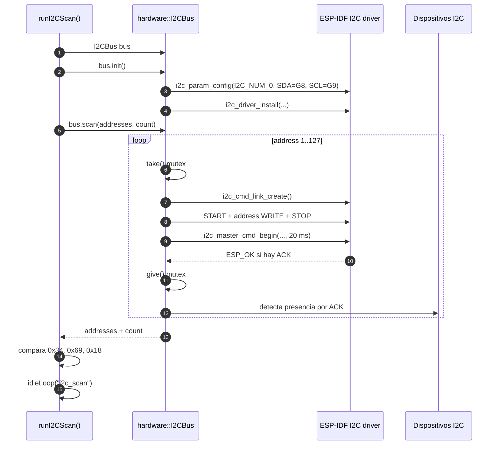
```mermaid
sequenceDiagram
    autonumber
    participant Smoke as runI2CScan()
    participant Bus as hardware::I2CBus
    participant ESP as ESP-IDF I2C driver
    participant Devs as Dispositivos I2C

    Smoke->>Bus: I2CBus bus
    Smoke->>Bus: bus.init()
    Bus->>ESP: i2c_param_config(I2C_NUM_0, SDA=G8, SCL=G9)
    Bus->>ESP: i2c_driver_install(...)
    Smoke->>Bus: bus.scan(addresses, count)
    loop address 1..127
        Bus->>Bus: take() mutex
        Bus->>ESP: i2c_cmd_link_create()
        Bus->>ESP: START + address WRITE + STOP
        Bus->>ESP: i2c_master_cmd_begin(..., 20 ms)
        ESP-->>Bus: ESP_OK si hay ACK
        Bus->>Bus: give() mutex
        Bus->>Devs: detecta presencia por ACK
    end
    Bus-->>Smoke: addresses + count
    Smoke->>Smoke: compara 0x34, 0x69, 0x18
    Smoke->>Smoke: idleLoop("i2c_scan")
```

---

## 11.2. Teclado: desde pulsar una tecla hasta obtener ASCII

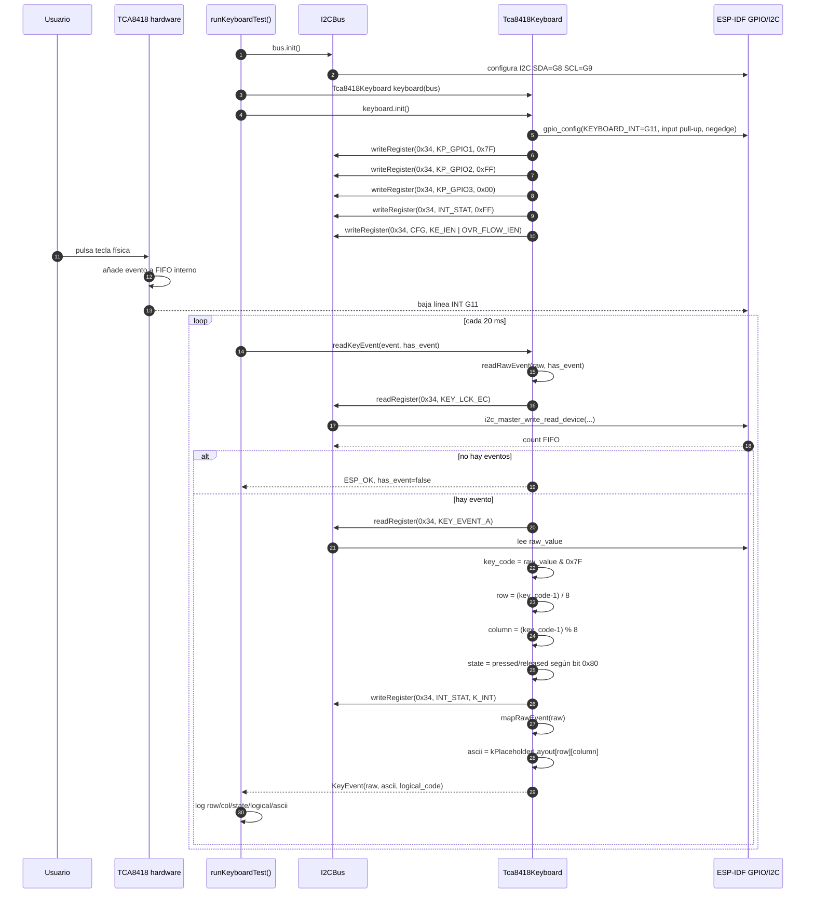
```mermaid
sequenceDiagram
    autonumber
    participant User as Usuario
    participant TCA as TCA8418 hardware
    participant Smoke as runKeyboardTest()
    participant Bus as I2CBus
    participant Kbd as Tca8418Keyboard
    participant ESP as ESP-IDF GPIO/I2C

    Smoke->>Bus: bus.init()
    Bus->>ESP: configura I2C SDA=G8 SCL=G9
    Smoke->>Kbd: Tca8418Keyboard keyboard(bus)
    Smoke->>Kbd: keyboard.init()
    Kbd->>ESP: gpio_config(KEYBOARD_INT=G11, input pull-up, negedge)
    Kbd->>Bus: writeRegister(0x34, KP_GPIO1, 0x7F)
    Kbd->>Bus: writeRegister(0x34, KP_GPIO2, 0xFF)
    Kbd->>Bus: writeRegister(0x34, KP_GPIO3, 0x00)
    Kbd->>Bus: writeRegister(0x34, INT_STAT, 0xFF)
    Kbd->>Bus: writeRegister(0x34, CFG, KE_IEN | OVR_FLOW_IEN)

    User->>TCA: pulsa tecla física
    TCA->>TCA: añade evento a FIFO interno
    TCA-->>ESP: baja línea INT G11

    loop cada 20 ms
        Smoke->>Kbd: readKeyEvent(event, has_event)
        Kbd->>Kbd: readRawEvent(raw, has_event)
        Kbd->>Bus: readRegister(0x34, KEY_LCK_EC)
        Bus->>ESP: i2c_master_write_read_device(...)
        ESP-->>Bus: count FIFO
        alt no hay eventos
            Kbd-->>Smoke: ESP_OK, has_event=false
        else hay evento
            Kbd->>Bus: readRegister(0x34, KEY_EVENT_A)
            Bus->>ESP: lee raw_value
            Kbd->>Kbd: key_code = raw_value & 0x7F
            Kbd->>Kbd: row = (key_code-1) / 8
            Kbd->>Kbd: column = (key_code-1) % 8
            Kbd->>Kbd: state = pressed/released según bit 0x80
            Kbd->>Bus: writeRegister(0x34, INT_STAT, K_INT)
            Kbd->>Kbd: mapRawEvent(raw)
            Kbd->>Kbd: ascii = kPlaceholderLayout[row][column]
            Kbd-->>Smoke: KeyEvent(raw, ascii, logical_code)
            Smoke->>Smoke: log row/col/state/logical/ascii
        end
    end
```

---

## 11.3. Pantalla: desde pedir escribir una letra hasta verla en el ST7789

Este flujo representa una llamada como:

```cpp
display.drawText(8, 90, "A", 0xFFFF, 0x0000);
```

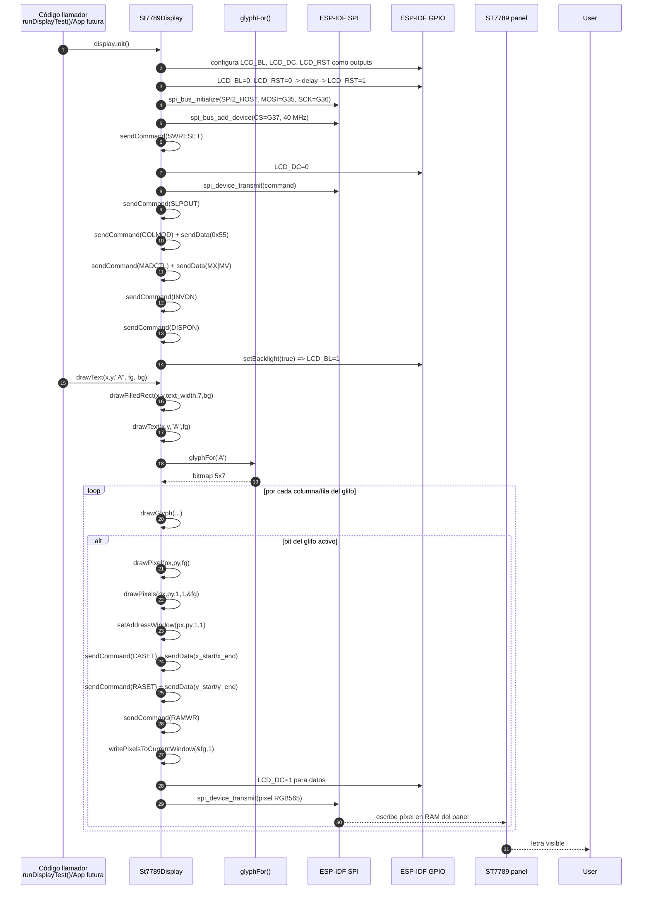
```mermaid
sequenceDiagram
    autonumber
    participant Caller as Código llamador<br/>runDisplayTest()/App futura
    participant Disp as St7789Display
    participant Glyph as glyphFor()
    participant SPI as ESP-IDF SPI
    participant GPIO as ESP-IDF GPIO
    participant LCD as ST7789 panel

    Caller->>Disp: display.init()
    Disp->>GPIO: configura LCD_BL, LCD_DC, LCD_RST como outputs
    Disp->>GPIO: LCD_BL=0, LCD_RST=0 -> delay -> LCD_RST=1
    Disp->>SPI: spi_bus_initialize(SPI2_HOST, MOSI=G35, SCK=G36)
    Disp->>SPI: spi_bus_add_device(CS=G37, 40 MHz)
    Disp->>Disp: sendCommand(SWRESET)
    Disp->>GPIO: LCD_DC=0
    Disp->>SPI: spi_device_transmit(command)
    Disp->>Disp: sendCommand(SLPOUT)
    Disp->>Disp: sendCommand(COLMOD) + sendData(0x55)
    Disp->>Disp: sendCommand(MADCTL) + sendData(MX|MV)
    Disp->>Disp: sendCommand(INVON)
    Disp->>Disp: sendCommand(DISPON)
    Disp->>GPIO: setBacklight(true) => LCD_BL=1

    Caller->>Disp: drawText(x,y,"A", fg, bg)
    Disp->>Disp: drawFilledRect(x,y,text_width,7,bg)
    Disp->>Disp: drawText(x,y,"A",fg)
    Disp->>Glyph: glyphFor('A')
    Glyph-->>Disp: bitmap 5x7

    loop por cada columna/fila del glifo
        Disp->>Disp: drawGlyph(...)
        alt bit del glifo activo
            Disp->>Disp: drawPixel(px,py,fg)
            Disp->>Disp: drawPixels(px,py,1,1,&fg)
            Disp->>Disp: setAddressWindow(px,py,1,1)
            Disp->>Disp: sendCommand(CASET) + sendData(x_start/x_end)
            Disp->>Disp: sendCommand(RASET) + sendData(y_start/y_end)
            Disp->>Disp: sendCommand(RAMWR)
            Disp->>Disp: writePixelsToCurrentWindow(&fg,1)
            Disp->>GPIO: LCD_DC=1 para datos
            Disp->>SPI: spi_device_transmit(pixel RGB565)
            SPI-->>LCD: escribe píxel en RAM del panel
        end
    end
    LCD-->>User: letra visible
```

### Por qué pasa por esos métodos

- `drawText(fg,bg)` primero limpia el fondo con `drawFilledRect()` para que el texto sea legible.
- `drawText(fg)` recorre caracteres.
- `drawGlyph()` convierte el bitmap 5x7 en píxeles individuales.
- Cada píxel acaba en `drawPixels()`.
- `drawPixels()` fija ventana ST7789 con `CASET/RASET`, manda `RAMWR` y escribe datos RGB565 por SPI.
- `LCD_DC` separa comandos (`0`) de datos (`1`).
- `LCD_CS` lo gestiona el dispositivo SPI configurado.

---

## 11.4. Backlight / “LED” de pantalla

No hay LED dedicado en el repo. Este es el flujo del actuador luminoso existente: `LCD_BL`.

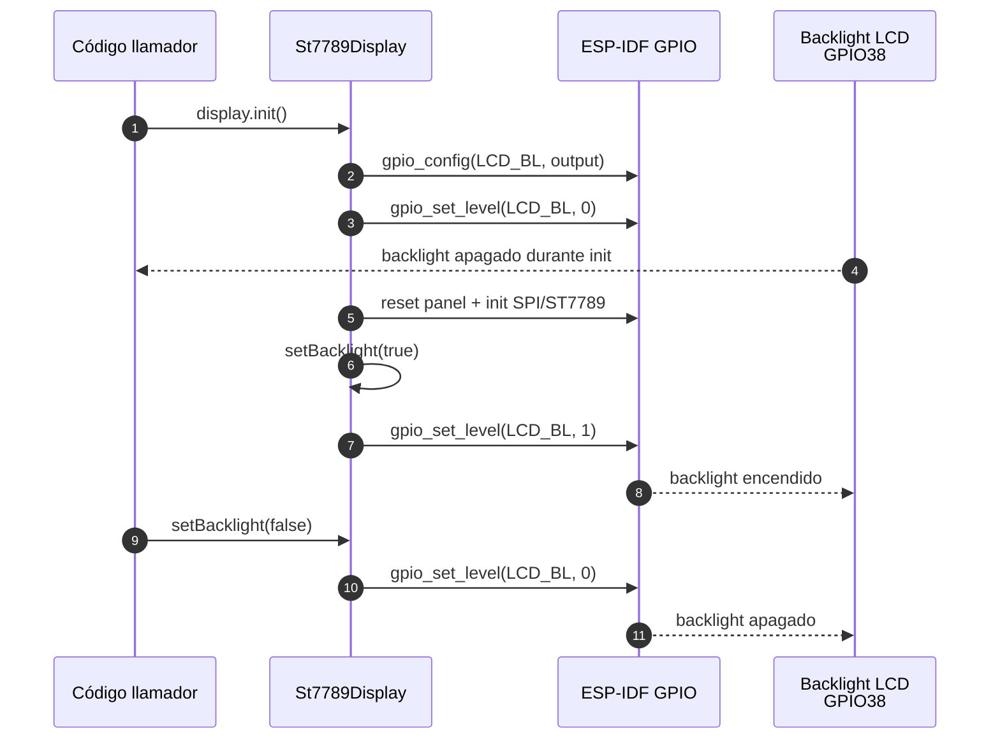
```mermaid
sequenceDiagram
    autonumber
    participant Caller as Código llamador
    participant Disp as St7789Display
    participant GPIO as ESP-IDF GPIO
    participant BL as Backlight LCD<br/>GPIO38

    Caller->>Disp: display.init()
    Disp->>GPIO: gpio_config(LCD_BL, output)
    Disp->>GPIO: gpio_set_level(LCD_BL, 0)
    BL-->>Caller: backlight apagado durante init
    Disp->>GPIO: reset panel + init SPI/ST7789
    Disp->>Disp: setBacklight(true)
    Disp->>GPIO: gpio_set_level(LCD_BL, 1)
    GPIO-->>BL: backlight encendido

    Caller->>Disp: setBacklight(false)
    Disp->>GPIO: gpio_set_level(LCD_BL, 0)
    GPIO-->>BL: backlight apagado
```

---

## 11.5. Wi-Fi scan

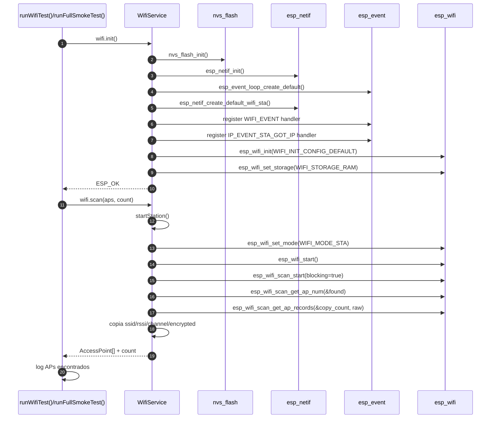
```mermaid
sequenceDiagram
    autonumber
    participant Smoke as runWifiTest()/runFullSmokeTest()
    participant Wifi as WifiService
    participant NVS as nvs_flash
    participant Netif as esp_netif
    participant Event as esp_event
    participant Driver as esp_wifi

    Smoke->>Wifi: wifi.init()
    Wifi->>NVS: nvs_flash_init()
    Wifi->>Netif: esp_netif_init()
    Wifi->>Event: esp_event_loop_create_default()
    Wifi->>Netif: esp_netif_create_default_wifi_sta()
    Wifi->>Event: register WIFI_EVENT handler
    Wifi->>Event: register IP_EVENT_STA_GOT_IP handler
    Wifi->>Driver: esp_wifi_init(WIFI_INIT_CONFIG_DEFAULT)
    Wifi->>Driver: esp_wifi_set_storage(WIFI_STORAGE_RAM)
    Wifi-->>Smoke: ESP_OK

    Smoke->>Wifi: wifi.scan(aps, count)
    Wifi->>Wifi: startStation()
    Wifi->>Driver: esp_wifi_set_mode(WIFI_MODE_STA)
    Wifi->>Driver: esp_wifi_start()
    Wifi->>Driver: esp_wifi_scan_start(blocking=true)
    Wifi->>Driver: esp_wifi_scan_get_ap_num(&found)
    Wifi->>Driver: esp_wifi_scan_get_ap_records(&copy_count, raw)
    Wifi->>Wifi: copia ssid/rssi/channel/encrypted
    Wifi-->>Smoke: AccessPoint[] + count
    Smoke->>Smoke: log APs encontrados
```

---

## 11.6. Wi-Fi connect

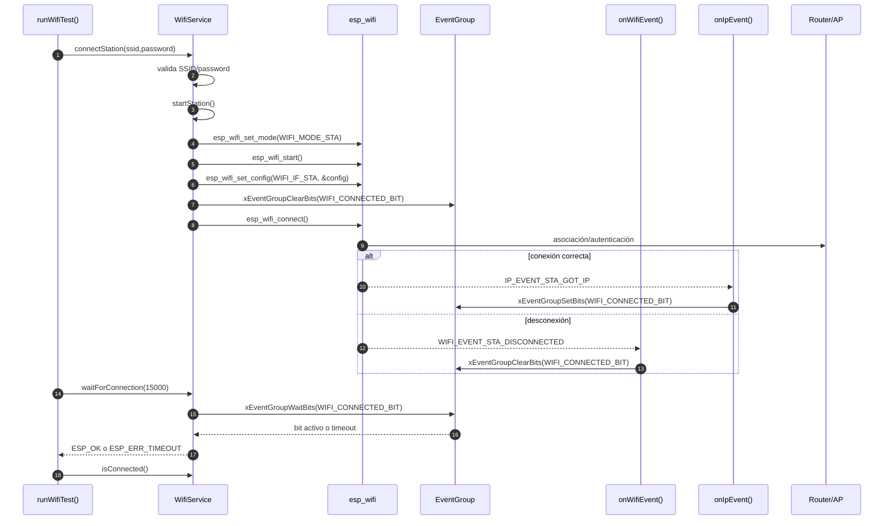
```mermaid
sequenceDiagram
    autonumber
    participant Smoke as runWifiTest()
    participant Wifi as WifiService
    participant Driver as esp_wifi
    participant Event as EventGroup
    participant WiFiEvt as onWifiEvent()
    participant IpEvt as onIpEvent()
    participant AP as Router/AP

    Smoke->>Wifi: connectStation(ssid,password)
    Wifi->>Wifi: valida SSID/password
    Wifi->>Wifi: startStation()
    Wifi->>Driver: esp_wifi_set_mode(WIFI_MODE_STA)
    Wifi->>Driver: esp_wifi_start()
    Wifi->>Driver: esp_wifi_set_config(WIFI_IF_STA, &config)
    Wifi->>Event: xEventGroupClearBits(WIFI_CONNECTED_BIT)
    Wifi->>Driver: esp_wifi_connect()
    Driver->>AP: asociación/autenticación

    alt conexión correcta
        Driver-->>IpEvt: IP_EVENT_STA_GOT_IP
        IpEvt->>Event: xEventGroupSetBits(WIFI_CONNECTED_BIT)
    else desconexión
        Driver-->>WiFiEvt: WIFI_EVENT_STA_DISCONNECTED
        WiFiEvt->>Event: xEventGroupClearBits(WIFI_CONNECTED_BIT)
    end

    Smoke->>Wifi: waitForConnection(15000)
    Wifi->>Event: xEventGroupWaitBits(WIFI_CONNECTED_BIT)
    Event-->>Wifi: bit activo o timeout
    Wifi-->>Smoke: ESP_OK o ESP_ERR_TIMEOUT
    Smoke->>Wifi: isConnected()
```

---

## 11.7. Audio / speaker: tono de prueba

Estado actual: el speaker depende de dos piezas:

1. `Es8311Codec`: configuración del codec por I2C. Actualmente incompleta.
2. `I2SAudio`: transporte de muestras PCM por I2S. Preparado.

El smoke test actual **salta la reproducción** si `codec.init(44100)` devuelve error. Como `Es8311Codec::init()` devuelve `ESP_ERR_NOT_SUPPORTED`, la ruta de tono queda bloqueada hasta implementar el codec.

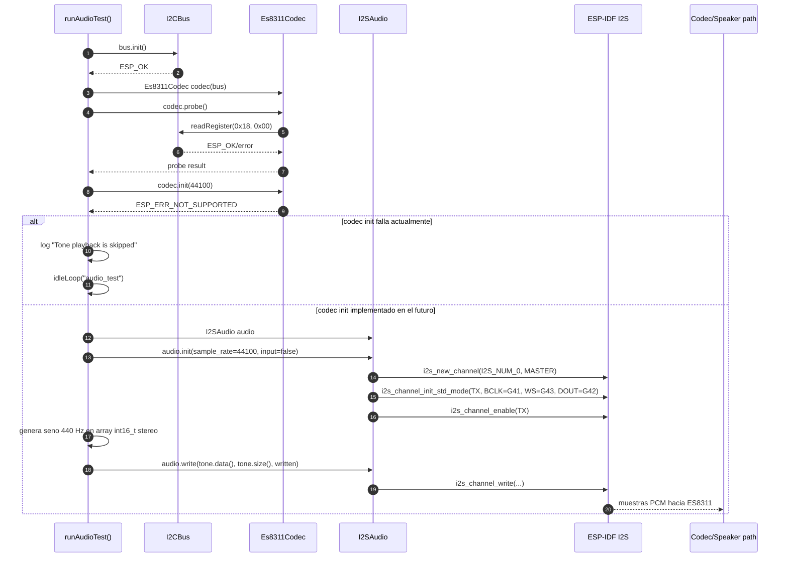
```mermaid
sequenceDiagram
    autonumber
    participant Smoke as runAudioTest()
    participant Bus as I2CBus
    participant Codec as Es8311Codec
    participant Audio as I2SAudio
    participant I2S as ESP-IDF I2S
    participant Speaker as Codec/Speaker path

    Smoke->>Bus: bus.init()
    Bus-->>Smoke: ESP_OK
    Smoke->>Codec: Es8311Codec codec(bus)
    Smoke->>Codec: codec.probe()
    Codec->>Bus: readRegister(0x18, 0x00)
    Bus-->>Codec: ESP_OK/error
    Codec-->>Smoke: probe result

    Smoke->>Codec: codec.init(44100)
    Codec-->>Smoke: ESP_ERR_NOT_SUPPORTED

    alt codec init falla actualmente
        Smoke->>Smoke: log "Tone playback is skipped"
        Smoke->>Smoke: idleLoop("audio_test")
    else codec init implementado en el futuro
        Smoke->>Audio: I2SAudio audio
        Smoke->>Audio: audio.init(sample_rate=44100, input=false)
        Audio->>I2S: i2s_new_channel(I2S_NUM_0, MASTER)
        Audio->>I2S: i2s_channel_init_std_mode(TX, BCLK=G41, WS=G43, DOUT=G42)
        Audio->>I2S: i2s_channel_enable(TX)
        Smoke->>Smoke: genera seno 440 Hz en array int16_t stereo
        Smoke->>Audio: audio.write(tone.data(), tone.size(), written)
        Audio->>I2S: i2s_channel_write(...)
        I2S-->>Speaker: muestras PCM hacia ES8311
    end
```

---

## 11.8. IMU BMI270: probe y lectura prevista

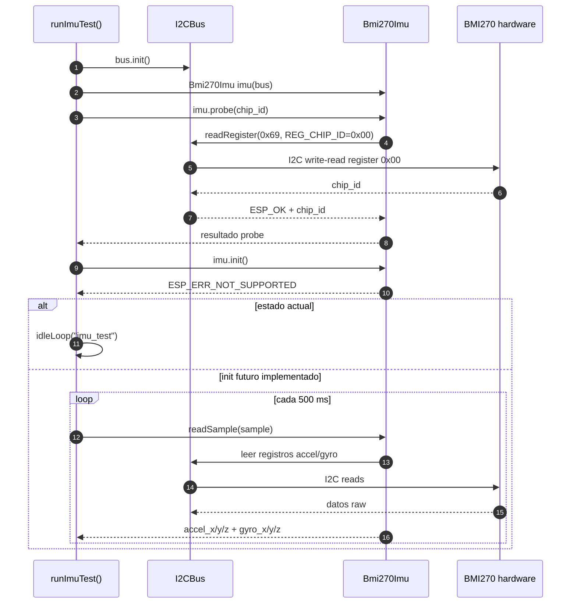
```mermaid
sequenceDiagram
    autonumber
    participant Smoke as runImuTest()
    participant Bus as I2CBus
    participant IMU as Bmi270Imu
    participant BMI as BMI270 hardware

    Smoke->>Bus: bus.init()
    Smoke->>IMU: Bmi270Imu imu(bus)
    Smoke->>IMU: imu.probe(chip_id)
    IMU->>Bus: readRegister(0x69, REG_CHIP_ID=0x00)
    Bus->>BMI: I2C write-read register 0x00
    BMI-->>Bus: chip_id
    Bus-->>IMU: ESP_OK + chip_id
    IMU-->>Smoke: resultado probe

    Smoke->>IMU: imu.init()
    IMU-->>Smoke: ESP_ERR_NOT_SUPPORTED

    alt estado actual
        Smoke->>Smoke: idleLoop("imu_test")
    else init futuro implementado
        loop cada 500 ms
            Smoke->>IMU: readSample(sample)
            IMU->>Bus: leer registros accel/gyro
            Bus->>BMI: I2C reads
            BMI-->>Bus: datos raw
            IMU-->>Smoke: accel_x/y/z + gyro_x/y/z
        end
    end
```

---

## 11.9. Batería ADC: raw y milivoltios aproximados

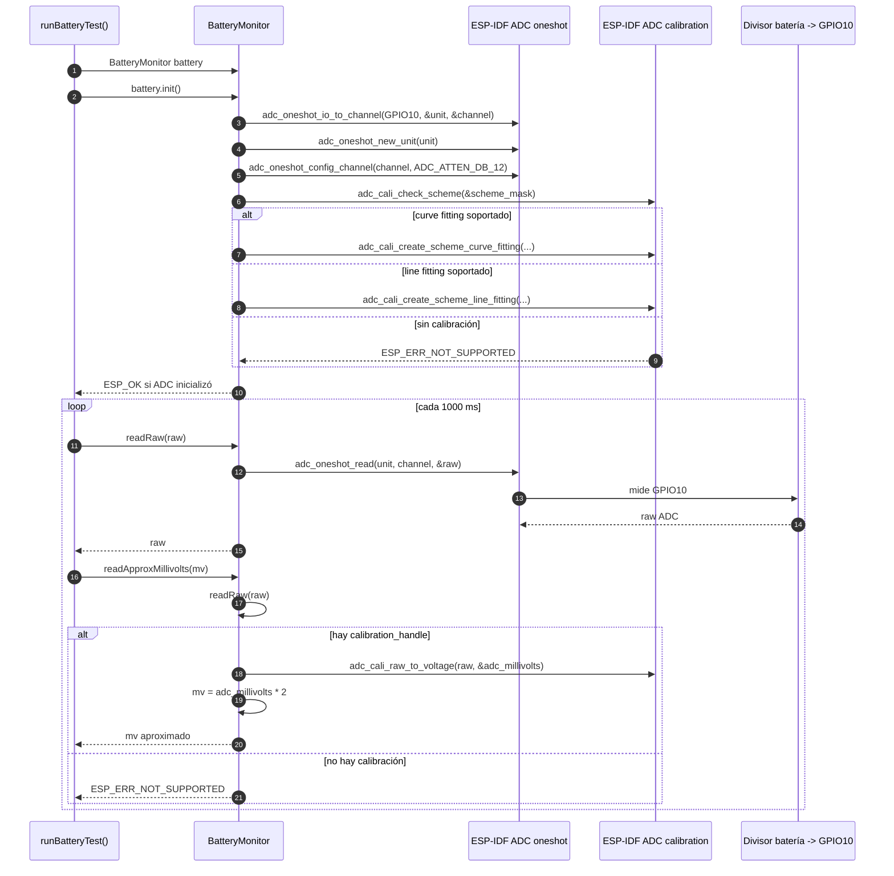
```mermaid
sequenceDiagram
    autonumber
    participant Smoke as runBatteryTest()
    participant Batt as BatteryMonitor
    participant ADC as ESP-IDF ADC oneshot
    participant CAL as ESP-IDF ADC calibration
    participant HW as Divisor batería -> GPIO10

    Smoke->>Batt: BatteryMonitor battery
    Smoke->>Batt: battery.init()
    Batt->>ADC: adc_oneshot_io_to_channel(GPIO10, &unit, &channel)
    Batt->>ADC: adc_oneshot_new_unit(unit)
    Batt->>ADC: adc_oneshot_config_channel(channel, ADC_ATTEN_DB_12)
    Batt->>CAL: adc_cali_check_scheme(&scheme_mask)
    alt curve fitting soportado
        Batt->>CAL: adc_cali_create_scheme_curve_fitting(...)
    else line fitting soportado
        Batt->>CAL: adc_cali_create_scheme_line_fitting(...)
    else sin calibración
        CAL-->>Batt: ESP_ERR_NOT_SUPPORTED
    end
    Batt-->>Smoke: ESP_OK si ADC inicializó

    loop cada 1000 ms
        Smoke->>Batt: readRaw(raw)
        Batt->>ADC: adc_oneshot_read(unit, channel, &raw)
        ADC->>HW: mide GPIO10
        HW-->>ADC: raw ADC
        Batt-->>Smoke: raw

        Smoke->>Batt: readApproxMillivolts(mv)
        Batt->>Batt: readRaw(raw)
        alt hay calibration_handle
            Batt->>CAL: adc_cali_raw_to_voltage(raw, &adc_millivolts)
            Batt->>Batt: mv = adc_millivolts * 2
            Batt-->>Smoke: mv aproximado
        else no hay calibración
            Batt-->>Smoke: ESP_ERR_NOT_SUPPORTED
        end
    end
```

---

## 11.10. microSD: montar, listar y escribir opcionalmente

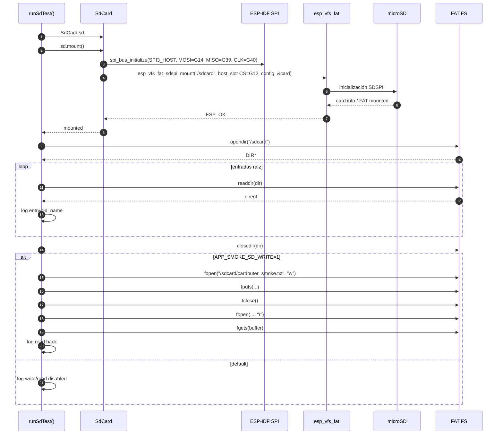
```mermaid
sequenceDiagram
    autonumber
    participant Smoke as runSdTest()
    participant SD as SdCard
    participant SPI as ESP-IDF SPI
    participant VFS as esp_vfs_fat
    participant Card as microSD
    participant FS as FAT FS

    Smoke->>SD: SdCard sd
    Smoke->>SD: sd.mount()
    SD->>SPI: spi_bus_initialize(SPI3_HOST, MOSI=G14, MISO=G39, CLK=G40)
    SD->>VFS: esp_vfs_fat_sdspi_mount("/sdcard", host, slot CS=G12, config, &card)
    VFS->>Card: inicialización SDSPI
    Card-->>VFS: card info / FAT mounted
    VFS-->>SD: ESP_OK
    SD-->>Smoke: mounted

    Smoke->>FS: opendir("/sdcard")
    FS-->>Smoke: DIR*
    loop entradas raíz
        Smoke->>FS: readdir(dir)
        FS-->>Smoke: dirent
        Smoke->>Smoke: log entry->d_name
    end
    Smoke->>FS: closedir(dir)

    alt APP_SMOKE_SD_WRITE=1
        Smoke->>FS: fopen("/sdcard/cardputer_smoke.txt", "w")
        Smoke->>FS: fputs(...)
        Smoke->>FS: fclose()
        Smoke->>FS: fopen(..., "r")
        Smoke->>FS: fgets(buffer)
        Smoke->>Smoke: log read back
    else default
        Smoke->>Smoke: log write/read disabled
    end
```

---

## 11.11. IR TX: transmitir patrón raw

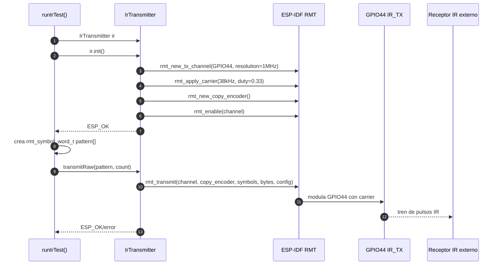
```mermaid
sequenceDiagram
    autonumber
    participant Smoke as runIrTest()
    participant IR as IrTransmitter
    participant RMT as ESP-IDF RMT
    participant Pin as GPIO44 IR_TX
    participant Receiver as Receptor IR externo

    Smoke->>IR: IrTransmitter ir
    Smoke->>IR: ir.init()
    IR->>RMT: rmt_new_tx_channel(GPIO44, resolution=1MHz)
    IR->>RMT: rmt_apply_carrier(38kHz, duty=0.33)
    IR->>RMT: rmt_new_copy_encoder()
    IR->>RMT: rmt_enable(channel)
    IR-->>Smoke: ESP_OK

    Smoke->>Smoke: crea rmt_symbol_word_t pattern[]
    Smoke->>IR: transmitRaw(pattern, count)
    IR->>RMT: rmt_transmit(channel, copy_encoder, symbols, bytes, config)
    RMT->>Pin: modula GPIO44 con carrier
    Pin-->>Receiver: tren de pulsos IR
    IR-->>Smoke: ESP_OK/error
```

---

## 11.12. LVGL demo hook

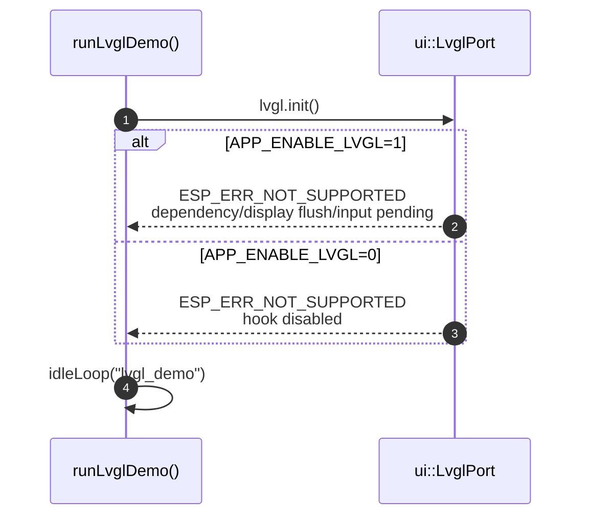
```mermaid
sequenceDiagram
    autonumber
    participant Smoke as runLvglDemo()
    participant LVGL as ui::LvglPort

    Smoke->>LVGL: lvgl.init()
    alt APP_ENABLE_LVGL=1
        LVGL-->>Smoke: ESP_ERR_NOT_SUPPORTED<br/>dependency/display flush/input pending
    else APP_ENABLE_LVGL=0
        LVGL-->>Smoke: ESP_ERR_NOT_SUPPORTED<br/>hook disabled
    end
    Smoke->>Smoke: idleLoop("lvgl_demo")
```

---

## 11.13. BLE hook

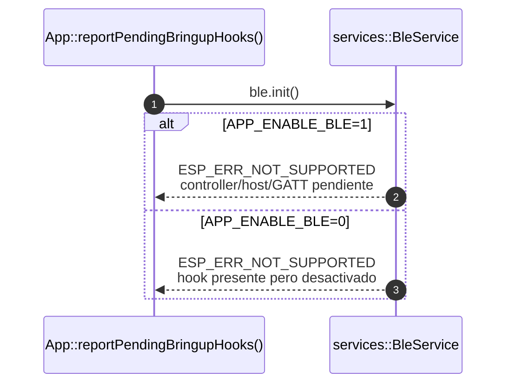
```mermaid
sequenceDiagram
    autonumber
    participant App as App::reportPendingBringupHooks()
    participant BLE as services::BleService

    App->>BLE: ble.init()
    alt APP_ENABLE_BLE=1
        BLE-->>App: ESP_ERR_NOT_SUPPORTED<br/>controller/host/GATT pendiente
    else APP_ENABLE_BLE=0
        BLE-->>App: ESP_ERR_NOT_SUPPORTED<br/>hook presente pero desactivado
    end
```

---

## 11.14. USB hook

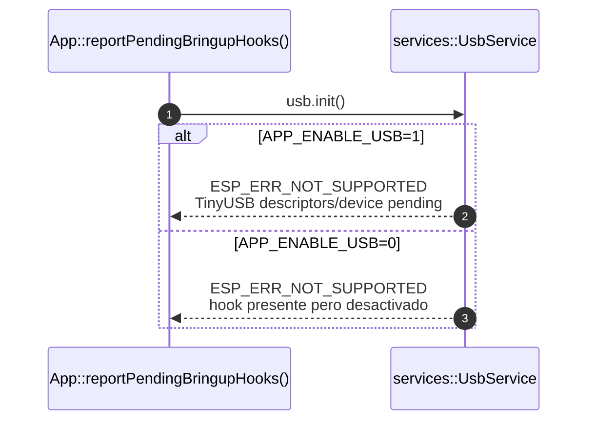
```mermaid
sequenceDiagram
    autonumber
    participant App as App::reportPendingBringupHooks()
    participant USB as services::UsbService

    App->>USB: usb.init()
    alt APP_ENABLE_USB=1
        USB-->>App: ESP_ERR_NOT_SUPPORTED<br/>TinyUSB descriptors/device pending
    else APP_ENABLE_USB=0
        USB-->>App: ESP_ERR_NOT_SUPPORTED<br/>hook presente pero desactivado
    end
```

---

## 11.15. Full smoke test integrado

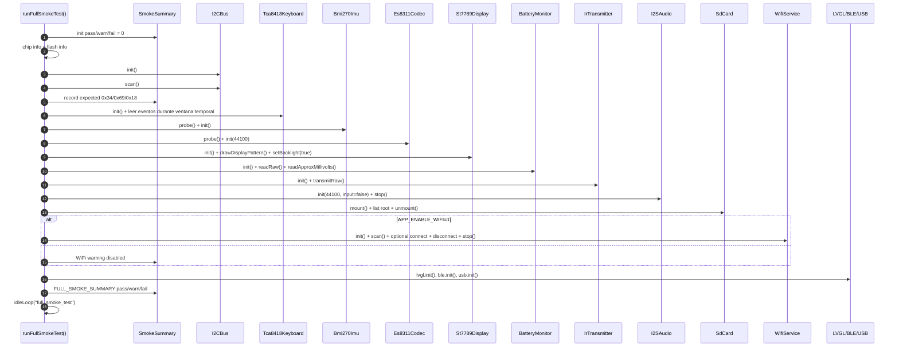
```mermaid
sequenceDiagram
    autonumber
    participant Smoke as runFullSmokeTest()
    participant Summary as SmokeSummary
    participant I2C as I2CBus
    participant KBD as Tca8418Keyboard
    participant IMU as Bmi270Imu
    participant Codec as Es8311Codec
    participant Display as St7789Display
    participant Battery as BatteryMonitor
    participant IR as IrTransmitter
    participant I2S as I2SAudio
    participant SD as SdCard
    participant WiFi as WifiService
    participant Hooks as LVGL/BLE/USB

    Smoke->>Summary: init pass/warn/fail = 0
    Smoke->>Smoke: chip info + flash info
    Smoke->>I2C: init()
    Smoke->>I2C: scan()
    Smoke->>Summary: record expected 0x34/0x69/0x18
    Smoke->>KBD: init() + leer eventos durante ventana temporal
    Smoke->>IMU: probe() + init()
    Smoke->>Codec: probe() + init(44100)
    Smoke->>Display: init() + drawDisplayPattern() + setBacklight(true)
    Smoke->>Battery: init() + readRaw() + readApproxMillivolts()
    Smoke->>IR: init() + transmitRaw()
    Smoke->>I2S: init(44100, input=false) + stop()
    Smoke->>SD: mount() + list root + unmount()
    alt APP_ENABLE_WIFI=1
        Smoke->>WiFi: init() + scan() + optional connect + disconnect + stop()
    else
        Smoke->>Summary: WiFi warning disabled
    end
    Smoke->>Hooks: lvgl.init(), ble.init(), usb.init()
    Smoke->>Summary: FULL_SMOKE_SUMMARY pass/warn/fail
    Smoke->>Smoke: idleLoop("full_smoke_test")
```

---

# 12. Relaciones dinámicas clave

## 12.1. Periféricos que dependen de I2C

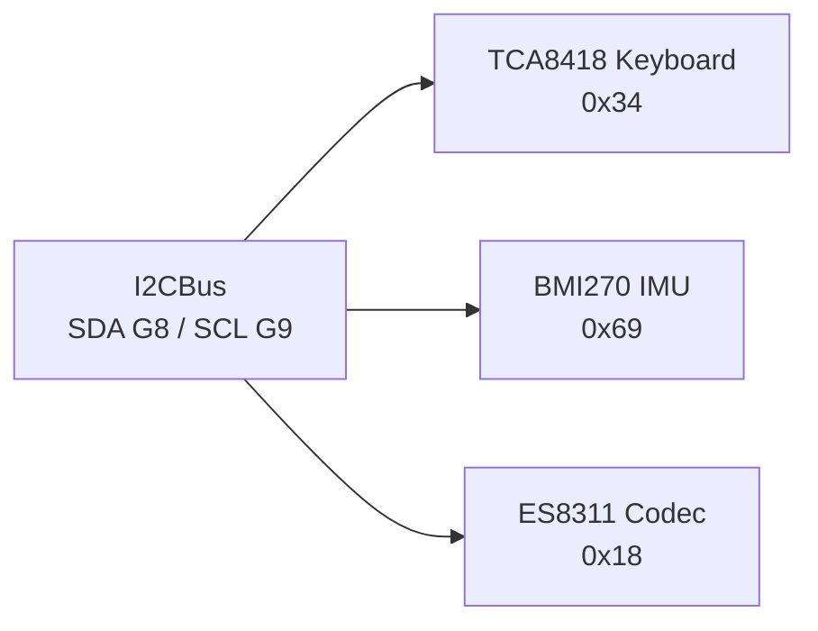
```mermaid
flowchart LR
    I2CBus[I2CBus\nSDA G8 / SCL G9] --> Keyboard[TCA8418 Keyboard\n0x34]
    I2CBus --> IMU[BMI270 IMU\n0x69]
    I2CBus --> Codec[ES8311 Codec\n0x18]
```

## 12.2. Periféricos que dependen de SPI/RMT/ADC/I2S

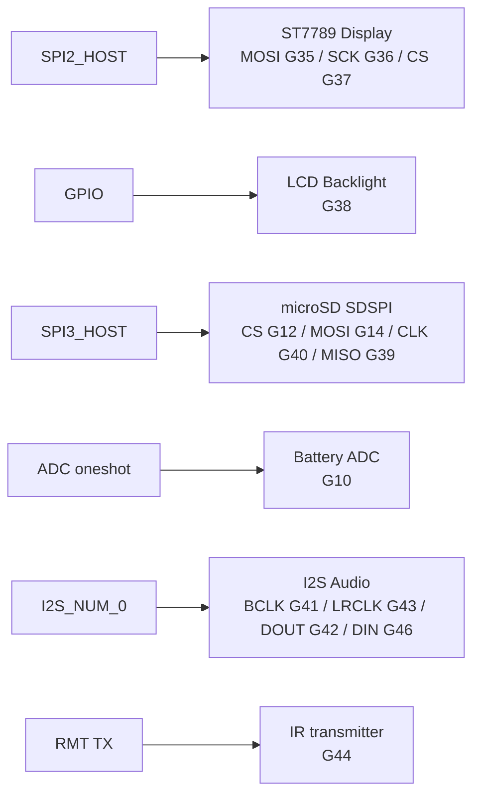
```mermaid
flowchart LR
    SPI2[SPI2_HOST] --> Display[ST7789 Display\nMOSI G35 / SCK G36 / CS G37]
    GPIO[GPIO] --> Backlight[LCD Backlight\nG38]
    SPI3[SPI3_HOST] --> SD[microSD SDSPI\nCS G12 / MOSI G14 / CLK G40 / MISO G39]
    ADC[ADC oneshot] --> Battery[Battery ADC\nG10]
    I2S[I2S_NUM_0] --> Audio[I2S Audio\nBCLK G41 / LRCLK G43 / DOUT G42 / DIN G46]
    RMT[RMT TX] --> IR[IR transmitter\nG44]
```

---

# 13. Comandos útiles

## 13.1. Tests nativos

```bash
pio test -e native
```

## 13.2. Build firmware base

```bash
pio run -e cardputer_adv
```

## 13.3. Upload y monitor

```bash
pio run -e cardputer_adv -t upload --upload-port COM5
pio device monitor -p COM5 -b 115200
```

## 13.4. Smoke test completo

```bash
pio run -e cardputer_adv_full_smoke_test -t upload --upload-port COM5
pio device monitor -p COM5 -b 115200
```

## 13.5. Wi-Fi con credenciales temporales en PowerShell

```powershell
$env:PLATFORMIO_BUILD_FLAGS='-DAPP_WIFI_SMOKE_SSID="your-ssid" -DAPP_WIFI_SMOKE_PASSWORD="your-password"'
pio run -e cardputer_adv_wifi_test -t upload --upload-port COM5
Remove-Item Env:\PLATFORMIO_BUILD_FLAGS
```

---

# 14. Observaciones de auditoría

## 14.1. Buenas decisiones arquitectónicas

1. `BoardPins.hpp` centraliza los pines. Evita pines mágicos repartidos por el código.
2. Cada periférico tiene clase propia. Esto facilita tests, refactor y sustitución de backend.
3. Los smoke tests están separados de `App`.
4. Los hooks pendientes devuelven `ESP_ERR_NOT_SUPPORTED`, no fallan silenciosamente.
5. El código portable está separado en `lib/common`.
6. La selección de modos por flags evita mezclar varias pruebas en un firmware pequeño.
7. `I2CBus` protege el bus con mutex.
8. Los destructores liberan recursos: I2C, SPI, I2S, RMT, ADC, SD.

## 14.2. Riesgos actuales

| Riesgo | Impacto | Recomendación |
|---|---|---|
| `App::reportPendingBringupHooks()` crea `I2CBus` sin `init()` y lo pasa a ES8311/BMI270 | Cuando esos init sean reales, pueden fallar por estado inválido | Inicializar bus en el hook o separar `probeHooks()` de `initHooks()`. |
| Layout del teclado placeholder | Teclas reales pueden no corresponder | Validar matriz real con esquemático y logs raw. |
| ST7789 offsets/rotación/color order pendientes de hardware | Imagen desplazada o colores invertidos | Añadir test visual con patrón de esquinas y calibración. |
| ES8311 sin secuencia de registros | Speaker no sonará aunque I2S funcione | Implementar bring-up codec antes de validar audio final. |
| BMI270 sin firmware/config | IMU no entrega samples | Añadir secuencia oficial BMI270 y modo low-level test. |
| Wi-Fi usa estado estático global | Varias instancias comparten estado | Aceptable para ESP-IDF, pero documentar singleton lógico. |
| `docs/hardware.md` parece desactualizado | Dice que no hay drivers reales aunque ya hay varios preparados | Actualizar documentación existente o sustituir por este documento. |
| No hay abstracción LED dedicada | Usuario puede esperar LED | Añadir `StatusLed` solo si el hardware tiene pin real disponible. |

## 14.3. Estado real frente a documentación existente

Hay señales de que parte de la documentación antigua está por detrás del código. Por ejemplo, el código ya incluye ST7789 con texto básico, batería calibrada, IR, SD y Wi-Fi preparado; sin embargo, documentación antigua aún habla de “skeleton” sin drivers reales. Conviene sincronizar `docs/hardware.md` y `docs/architecture.md`.

---

# 15. Próximos pasos recomendados

## 15.1. Para dejar el template como base sólida

1. Añadir `docs/code-documentation.md` con este contenido o una versión condensada.
2. Actualizar `docs/hardware.md` para reflejar el estado real.
3. Añadir una tabla `peripheral_status.md` con estado: prepared / partial / stub / validated.
4. Añadir un `HardwareBringupChecklist.md`.
5. Crear una clase `Board` o `HardwareContext` que centralice instancias compartidas si el proyecto deja de ser solo smoke tests.
6. Definir una política para recursos singleton de ESP-IDF: I2C, SPI, Wi-Fi, I2S.
7. Añadir logs de commit/build info al arranque.

## 15.2. Para pantalla

1. Validar offsets X/Y en hardware real.
2. Verificar RGB/BGR.
3. Añadir `drawBitmap()`.
4. Añadir clipping real en primitivas.
5. Valorar backend `esp_lcd` opcional.
6. Integrar LVGL solo cuando la base SPI esté estable.

## 15.3. Para teclado

1. Crear modo que imprima solo `row`, `column`, `raw_value`, pressed/released.
2. Pulsar todas las teclas y construir layout real.
3. Añadir modificadores: Shift, Fn, símbolos.
4. Convertir `kPlaceholderLayout` en layout definitivo o configurable.

## 15.4. Para audio

1. Implementar ES8311 init completo.
2. Separar `CodecControl` de `AudioTransport`.
3. Añadir test de volumen/mute.
4. Añadir test de reproducción corta con WAV PCM desde memoria o SD.

## 15.5. Para IMU

1. Añadir secuencia de firmware/config del BMI270.
2. Validar chip ID.
3. Configurar rango accel/gyro.
4. Implementar lectura de registros raw.
5. Añadir conversión a g/dps.

## 15.6. Para batería

1. Validar ratio real del divisor en esquemático.
2. Añadir filtro de media móvil.
3. Añadir porcentaje aproximado LiPo.
4. Documentar que no hay estado de carga/corriente si el hardware no lo expone.

## 15.7. Para Wi-Fi

1. Evitar pasar credenciales por build flags en workflows públicos.
2. Añadir soporte opcional a NVS local o menú serie.
3. Añadir timeout y retry policy.
4. Añadir `getIpInfo()`.

## 15.8. Para BLE/USB/LVGL

1. Elegir stack BLE y caso de uso.
2. Para USB, decidir CDC/HID/MIDI antes de implementar.
3. Para LVGL, empezar con display flush simple y teclado como input device.

---

# 16. Resumen final

El repositorio está bien planteado como **template técnico de bring-up** para Cardputer-Adv: separa aplicación, smoke tests, hardware HAL, servicios y utilidades portables. La parte más madura actualmente parece ser:

- build PlatformIO,
- pin map,
- I2C,
- pantalla básica,
- batería ADC,
- microSD,
- IR,
- Wi-Fi opcional,
- tests portables.

Las partes que siguen claramente en bring-up o stub son:

- codec ES8311,
- IMU BMI270,
- BLE,
- USB,
- LVGL,
- layout definitivo del teclado.

La arquitectura ya es suficientemente buena para usarla como base de proyectos futuros, siempre que se mantenga la regla principal: **cada periférico debe tener una frontera clara, pruebas de smoke independientes y documentación sincronizada con el código real**.

